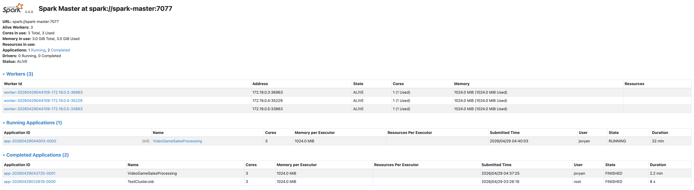
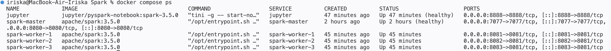
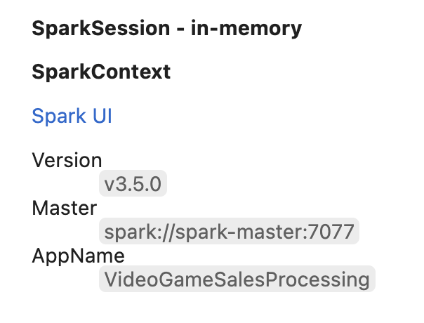
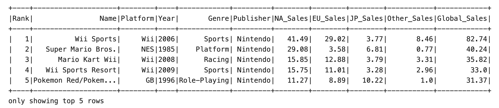
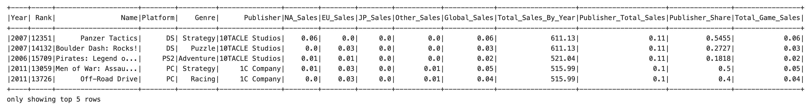

# Spark Data Processing Pipeline

A data processing and analytics service built with Apache Spark and PySpark.  
The project processes the **Video Game Sales** dataset — cleaning, aggregating, and saving results as Parquet.

---

## Tech Stack

| Tool | Purpose |
|---|---|
| Apache Spark 3.5.0 | Distributed data processing engine |
| PySpark | Python API for Spark |
| Docker Compose | Container orchestration |
| JupyterLab | Interactive notebook environment |
| Parquet | Columnar storage for processed output |

---

## Architecture

```
JupyterLab (driver)
      |
      | spark://spark-master:7077
      |
Spark Master
      |
 _____|______
|     |      |
W1   W2     W3       <- Spark Workers (executors)
```

- **Spark Master** — manages the cluster, distributes tasks to workers
- **Spark Workers** — execute tasks and return results to the driver
- **JupyterLab** — acts as the Spark driver; PySpark code runs here and jobs are submitted to the cluster
- **data/raw/** — input CSV files
- **data/processed/** — Parquet output after pipeline execution

---

## Project Structure

```
spark-data-processing-pipeline/
├── data/
│   ├── raw/                   # Input datasets (not in git)
│   └── processed/             # Parquet output (not in git)
├── jobs/
│   └── test_job.py            # Spark cluster smoke test
├── notebooks/
│   └── 01_pyspark_data_processing.ipynb
├── screenshots/               # Screenshots for the report
├── docker-compose.yml
├── .gitignore
└── README.md
```

---

## How to Run

**1. Start the cluster**

```bash
docker compose up -d
```

**2. Check that all containers are running**

```bash
docker compose ps
```

Expected: 5 containers up — `spark-master`, `spark-worker-1/2/3`, `jupyter`.

**3. Open interfaces**

| Interface | URL |
|---|---|
| Spark Master UI | http://localhost:8080 |
| JupyterLab | http://localhost:8888 |
| Worker 1 | http://localhost:8081 |
| Worker 2 | http://localhost:8082 |
| Worker 3 | http://localhost:8083 |

**4. Connect the notebook to the Jupyter kernel**

**Option A — directly in the browser (JupyterLab)**

1. Open [http://localhost:8888](http://localhost:8888)
2. In the file browser on the left, open `work/`
3. Double-click `01_pyspark_data_processing.ipynb`
4. The kernel **Python 3 (ipykernel)** starts automatically — no extra steps needed

**Option B — from VS Code**

1. Open `notebooks/01_pyspark_data_processing.ipynb` in VS Code
2. Click **Select Kernel** in the top-right corner of the notebook
3. Choose **Existing Jupyter Server...**
4. Enter the server URL: `http://localhost:8888`
5. Leave the token field **empty** and press Enter
6. Select kernel **Python 3 (ipykernel)**

**5. Run the notebook**

Run all cells top to bottom. The first cell creates a `SparkSession` connected to `spark://spark-master:7077`.  
You can verify the connection in the **Spark Master UI** at [http://localhost:8080](http://localhost:8080) — the application will appear under *Running Applications*.

**6. Stop the cluster**

```bash
docker compose down
```

---

## Dataset

**Video Game Sales** — sales data for video games with more than 100,000 copies sold.

Source: [Kaggle — Video Game Sales](https://www.kaggle.com/datasets/gregorut/videogamesales)

| Column | Description |
|---|---|
| Rank | Ranking by global sales |
| Name | Game title |
| Platform | Platform (PS2, Wii, X360, etc.) |
| Year | Year of release |
| Genre | Game genre |
| Publisher | Publisher name |
| NA_Sales | Sales in North America (millions) |
| EU_Sales | Sales in Europe (millions) |
| JP_Sales | Sales in Japan (millions) |
| Other_Sales | Sales in other regions (millions) |
| Global_Sales | Total worldwide sales (millions) |

---

## Processing Pipeline

Steps performed inside the notebook:

1. **Load CSV** — read `vgsales.csv` with inferred schema
2. **Clean and normalize** — drop nulls, cast types, rename columns
3. **Total sales by year** — aggregate global sales per release year
4. **Sales by year / platform / region** — grouped aggregations across NA, EU, JP, Other
5. **Sales share with Window Functions** — calculate each platform's share within a year using `Window.partitionBy`
6. **Publisher sales share** — rank publishers by total global sales share
7. **Total sales per game** — sum all regional columns into one `total_sales` field
8. **Save as Parquet** — write final DataFrame to `data/processed/videogame_sales_parquet/`

---

## Screenshots

### Spark Cluster UI


### Docker Containers Running


### SparkSession Connection


### Dataset Preview


### Data Cleaning — Schema


### Total Sales by Year


### Sales Share — Window Function


### Parquet Output


---

## Results

- Final dataset saved in Parquet format at `data/processed/videogame_sales_parquet/`
- Row count before saving matches row count after reading back from Parquet
- All transformations performed via PySpark DataFrame API on a distributed Spark cluster

---

## Notes

- The dataset `vgsales.csv` is included in `data/raw/`
- Parquet output is included in `data/processed/videogame_sales_parquet/`
- Jupyter runs without a token — access via [http://localhost:8888](http://localhost:8888) with no password
